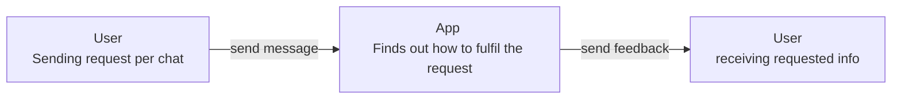
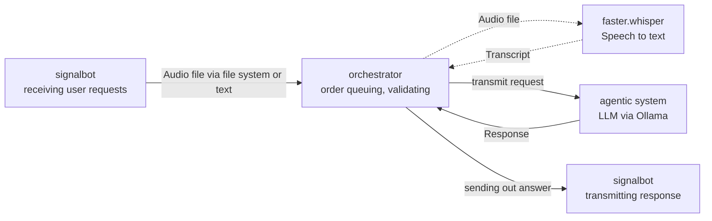
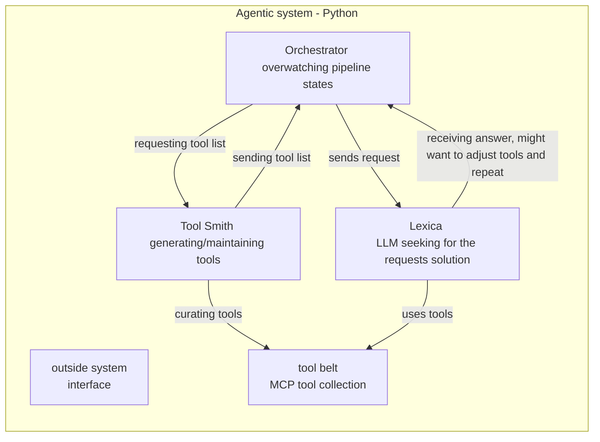
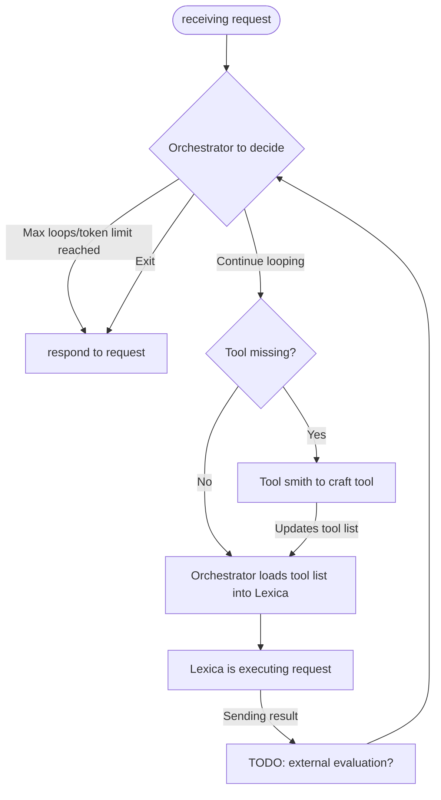
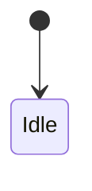

# Architecture concepts

## Decisions

- [ADR-001](docs/decisions/ADR-001-pipeline-context-object.md) - Pipeline Context Object
- [ADR-002](docs/decisions/ADR-002-multi-tenant-operation.md) - Multi Tenant Operation
- [ADR-003](docs/decisions/ADR-003-opentelemetry.md) - OpenTelemetry
- [ADR-004](docs/decisions/ADR-004-no-langchain-usage.md) - No LangChain
- [ADR-005](docs/decisions/ADR-005-split-signalbot-up-to-improve-DI.md) - Using DI on signalbot interfacing logic
- [ADR-006](docs/decisions/ADR-006-GDPR.md) - GDPR is respected

## Diagrams

### Context diagram

### Container diagram

### Component diagram agentic system

