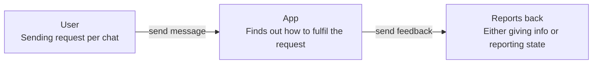
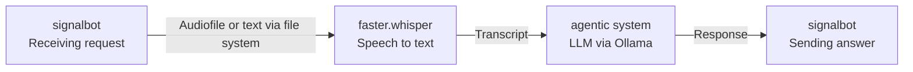
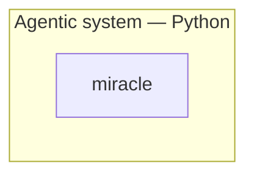
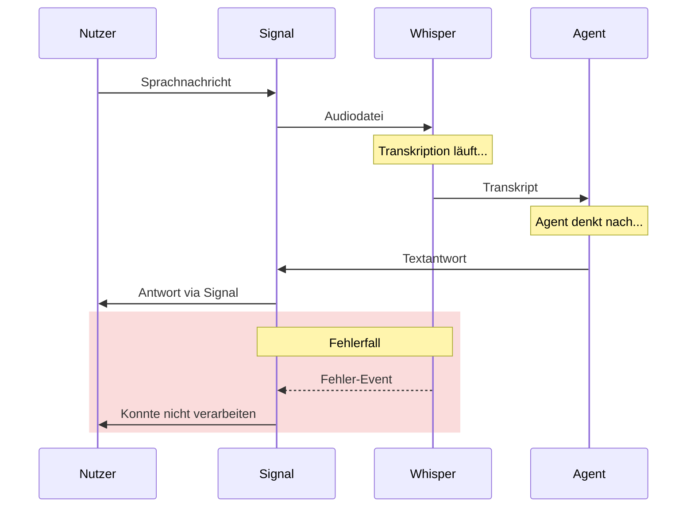

# Architecture concepts

This diagram should give guidance how the app is build. it especially guides the developer himself to find out of rabbits hole again xD

## Diagrams

### Context diagram

### Container diagram

### Component diagram agentic system

### Sequence diagram

## Decisions